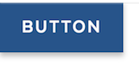
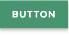
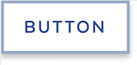
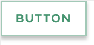
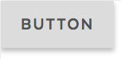
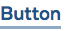
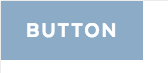
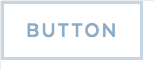
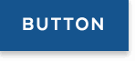
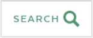

# Buttons

## Overview

Buttons are vital for creating a smooth conversational flow on the web, and should be used sparingly. Buttons should adhere to standard web practices, and afford for a target area of 45 pixels. They should also appear slightly raised, and not be completely flat. They have a slight shadow on them so they appear clickable. The small buttons are often used on forms and to set filters on listing pages. The large buttons should be used for primary calls to action. Font sizes reduce slightly on mobile.

## Usage

### Button Variations

| **Visual** | **Name** | **Description & Usage** |
| :--- | :--- | :--- |
|  | [Primary Button](buttons.md#primary-button) | For the principle call to action on the page. Default buttons are solid colors with uppercased button text \(this is configurable with an capitalized option for longer button text\) Box shadow are used to accentuate the actions. The hover state of the primary button lightens the button background color. |
|  | Secondary Button | For the secondary action on a page. The outline button provides a less prominent visual to indicate an less important action on a page, e.g. the Back button. The hover state of the secondary button inverts the background/foreground colors. |
|  | Tertiary Button | For the third action on a page. This is a solid gray button with a lighter background color than the foreground text. The muted color makes this button less prominent on a page than the secondary outline button a providing an option for a tertiary action. The hover state of this button will invert background color with white color text. |
|  | Quaternary Button | For an subtle action on a page. |
|   | Disabled Button | Box shadow on default buttons are used to accentuate the actions. For disabled buttons, box shadow is removed and opacity for the button is set to 0.5 for a muted look and no hover or focus state is provided. |
|  | [Link Button](buttons.md#link-button) | Link buttons are used to navigate to another page |
|  | [Icon Button](buttons.md#icon-button) | When words are not enough, icons can be used in buttons to better communicate what the button does. Icons are always paired with text. |
|  | [Search Button](buttons.md#search-button) | The search button is a variant of the icon button. It is a submit button included in the search bar, for the form to reduce the number of keystrokes required to use the form. On mobile, it will reduced to the icon. The magnifying glass is universally recognized by users as an indicator of search, and doesn’t need to be visually paired with the word "Search" as long as it remains for screen readers. |

### Accessibility & Best Practices

* Avoid using `<div>` or `` tags to create buttons. Screen readers don't automatically know either is a usable button.
* Buttons should display a visible focus state when users tab to them.
* The label text and the background have a color contrast to meet the WCAG guideline.
* `<button>` has built-in keyboard accessibility — it can be tabbed between, and activated using Return/Enter.
* When an icon or any image is included in `<button>`; 
  1. if the icon or image is NOT decorative, make sure they have text alternative presentation.
  2. if it is decorative \(= use them supplementary\) with text for its label, do not add any text alternative to it.  Use `aria-hidden="true"`, empty alt attribute `alt=""`. Do not use `title` and other aria attributes to make the icon or image recognizable to assistive technologies.
* When styling links to look like buttons, remember that screen readers handle links slightly differently than they do buttons. Pressing the Space key triggers a button, but pressing the Enter key triggers a link.
* Avoid using `<div>` or `` tags to create buttons. Screen readers don't automatically know either is a usable button.
* Buttons should display a visible focus state when users tab to them.
* The label text and the background have a color contrast to meet the WCAG guideline.
* `<button>` has built-in keyboard accessibility — it can be tabbed between, and activated using Return/Enter.
* When an icon or any image is included in `<button>`; 
  1. if the icon or image is NOT decorative, make sure they have text alternative presentation.
  2. if it is decorative \(= use them supplementary\) with text for its label, do not add any text alternative to it.  Use `aria-hidden="true"`, empty alt attribute `alt=""`. Do not use `title` and other aria attributes to make the icon or image recognizable to assistive technologies.
* When styling links to look like buttons, remember that screen readers handle links slightly differently than they do buttons. Pressing the Space key triggers a button, but pressing the Enter key triggers a link.

## Code

### Primary Button







```markup
<button type="button" class="ma__button" aria-label="Example primary button">
  Button
</button>
```



[Primary Button in Storybook](https://mayflower.digital.mass.gov/react/?knob-button.info=this%20will%20be%20the%20tooltip%20text%20on%20hover&knob-button.text=button&knob-button.href=&selectedKind=atoms%2Fbuttons&selectedStory=Button&full=0&addons=1&stories=1&panelRight=0&addonPanel=storybook%2Factions%2Factions-panel)



[Primary Button in Pattern Lab](https://mayflower.digital.mass.gov/patternlab/?p=atoms-button)​



### Secondary Button







```markup
<button type="button" class="ma__button ma__button--secondary" aria-label="Example secondary button">
  Button
</button>
```



[Secondary Button in Storybook](https://mayflower.digital.mass.gov/react/?knob-button.theme=secondary&knob-button.info=this%20will%20be%20the%20tooltip%20text%20on%20hover&knob-button.text=button&knob-button.href=&knob-button.outline=true&selectedKind=atoms%2Fbuttons&selectedStory=Button&full=0&addons=1&stories=1&panelRight=0&addonPanel=storybooks%2Fstorybook-addon-knobs)



[Secondary Button in Pattern Lab](https://mayflower.digital.mass.gov/patternlab/?p=atoms-button-as-secondary-color)



### Tertiary Button







Work in Progress



Work in Progress



Work in Progress



### Link Button







```markup
<a href="#" class="ma__button" title="">
  Button
</a>
```



[Link Button in Storybook](https://mayflower.digital.mass.gov/react/?knob-button.href=https%3A%2F%2Fmass.gov&knob-button.text=button&knob-button.info=this%20will%20be%20the%20tooltip%20text%20on%20hover&knob-ButtonWithIcon.text=BUTTON&knob-ButtonWithIcon.icon=chevron&selectedKind=atoms%2Fbuttons&selectedStory=Button&full=0&addons=1&stories=1&panelRight=0&addonPanel=storybooks%2Fstorybook-addon-knobs)



[Link Button in Pattern Lab](https://mayflower.digital.mass.gov/patternlab/?p=atoms-button-as-link)



### Icon Button







```markup
<button class="ma__button-icon">
  <span>BUTTON</span>
  <svg aria-hidden="true" width="20" height="20" viewBox="0 0 59 38" xmlns="http://www.w3.org/2000/svg"><path d="M29.414,37.657 L0.344,8.586 L8.828,0.102 L29.414,20.686 L50,0.1 L58.484,8.585 L29.414,37.657"></path></svg>
</button>
```



[Icon Button in Storybook](https://mayflower.digital.mass.gov/react/?knob-ButtonWithIcon.canExpand=true&knob-button.href=&knob-button.text=button&knob-ButtonWithIcon.capitalized=true&knob-button.info=this%20will%20be%20the%20tooltip%20text%20on%20hover&knob-ButtonWithIcon.text=BUTTON&knob-ButtonWithIcon.icon=chevron&knob-ButtonWithIcon.expanded=true&selectedKind=atoms%2Fbuttons&selectedStory=ButtonWithIcon&full=0&addons=1&stories=1&panelRight=0&addonPanel=storybooks%2Fstorybook-addon-knobs)



Not Available



### **Search Button**







```markup
<button type="submit" class="ma__button-icon  ma__button-search" tabindex="0" aria-label="search">
  <span>Search</span>
  <svg aria-hidden="true" xmlns="http://www.w3.org/2000/svg" width="20" height="20" viewBox="0 0 20 20">
    <path d="M1424.99 107.4L1419.66 102.105C1420.44 100.884 1420.89 99.4383 1420.89 97.8892C1420.89 93.54 1417.3300000000002 90 1412.95 90C1408.57 90 1405.01 93.54 1405.01 97.89C1405.01 102.241 1408.57 105.781 1412.95 105.781C1414.43 105.781 1415.82 105.375 1417.01 104.67L1422.3799999999999 110ZM1407.97 97.89C1407.97 95.1625 1410.2 92.9416 1412.95 92.9416C1415.7 92.9416 1417.93 95.1617 1417.93 97.89C1417.93 100.619 1415.7 102.839 1412.95 102.839C1410.2 102.839 1407.97 100.619 1407.97 97.89Z" transform="matrix(1,0,0,1,-1405,-90)"></path>
  </svg>
</button>
```



[Search Button In Storybook](https://mayflower.digital.mass.gov/react/?selectedKind=atoms%2Fbuttons&selectedStory=ButtonSearch)



[Search Button in Pattern Lab](https://mayflower.digital.mass.gov/patternlab/?p=atoms-button-search)



## Style

### Classnames

| **Name** | **Class Modifier** |
| :--- | :--- |
| Primary Button | `.ma__button` |
| Secondary Button | `.ma__button--secondary` _\(work in progress\)_`.ma__button--minor` \(_previous version_\) |
| Tertiary Button | `.ma__button--tertiary` _\(work in progress\)_ |
| Quaternary Button | `.ma__button--quaternary` _\(work in progress\)_ |
| Small Button | `.ma__button--small` |
| Large Button | `.ma__button--large` |
| Icon Button | `.ma__button--icon` |
| Search Button | `.ma__button--icon .ma__button--search` |
| Capitalized Button | `.ma__button--capitalized` |
| Disabled Button | `.ma__button--disabled` _\(work in progress\)_ |
| Color Button \(Primary Color\) | `.ma__button--c-primary` _\(work in progress\)_ |
| Alt Color Button \(Primary Alt Color\) | `.ma__button--c-primary-alt` _\(work in progress\)_ |

