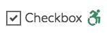
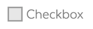

# Checkbox

## Overview

Checkboxes allow users to select one or more values from a set list, including all or none. It is best to use checkboxes when the user needs to be able to see all available options at a single time. Use checkboxes when looking for yes or no answers. They can be used as a single option without alternatives. If only one option is to be selected in a set of options at a time, radio buttons should be used instead.

Checkboxes can be presented as either checked \(pre-selected\) or unchecked when the page loads.

Each checkbox needs a label and, optionally, can include an icon. All options need to be grouped with `name` attribute for their association.

### Checkbox States

| Visual | Name | Description |
| :--- | :--- | :--- |
|  | Standard |  |
|  | Checked |  |
|  | Disabled |  |
|  | Error |  |
|  | Focus |  |

### Accessibility & Best Practices

* **Label**
  * Pairing each checkbox with a label is crucial to both usability and accessibility.  The label describes the checkbox. The label for each checkbox should indicate, via the `for` attribute the `id` of the input the label is associated with. 
  * A further benefit of using labels is that the user can click on the label itself to set the page's focus to the form element. This is particularly useful for users with motor disabilities, as it expands the focusable area beyond the small checkbox. Clicking adjacent labels also provides an easy way to check for proper form labeling.
* **Checkbox**
  * A checkbox's `id` attribute identifies the checkbox as a unique element in the page. Ensure the `id` value is unique on the page. 
  * A group of checkboxes should share a common value for their `name` attribute. 
  * Related checkboxes should be grouped in a `<fieldset>` with a `<legend>` to provide context about the checkbox grouping. If you are using a single checkbox, you do not need to wrap it in a `<fieldset>`.
* **Icon**
  * When words are not enough, icons can be used with checkboxes to better communicate what the checkbox is. Icons are always paired with text. 
  * When the icon conveys the same text content as the `<label>`'s, the icon is being used for decorative purposes and should have its `aria-hidden` attribute set to `true`. In this scenario, no text alternative is necessary and assistive technologies can ignore the icon. 
  * If the icon presents additional information to the label text content, the icon should not have `aria-hidden="true"` and provides text alternative through `alt`, visually hidden text, or other methods assistive technologies can access.

## Code



```markup
<span class="ma__input-checkbox">
  <input type="checkbox" value="checkbox" id="checkbox-test" checked>
      <svg aria-hidden="true"><use xlink:href="#ad9cad6e723fea69d5c6b3f55a99aa0b.0"></use></svg><svg xmlns="http://www.w3.org/2000/svg" style="display: none"><symbol xmlns="http://www.w3.org/2000/svg" aria-hidden="true" version="1.1" viewBox="0 0 31 40" id="ad9cad6e723fea69d5c6b3f55a99aa0b.0"><path d="M1311.33 360.136C1310.86 359.644 1310.1899999999998 359.38500000000005 1309.51 359.422L1301.29 359.88300000000004L1305.81 354.69000000000005C1306.46 353.95000000000005 1306.6399999999999 352.96400000000006 1306.3899999999999 352.083C1306.2599999999998 351.47900000000004 1305.8999999999999 350.92900000000003 1305.34 350.57800000000003C1305.32 350.56600000000003 1294.53 344.244 1294.53 344.244C1293.6499999999999 343.728 1292.53 343.84200000000004 1291.77 344.526L1286.5 349.26800000000003C1285.53 350.141 1285.44 351.64300000000003 1286.31 352.62300000000005C1287.1799999999998 353.60200000000003 1288.6699999999998 353.68800000000005 1289.6399999999999 352.814L1293.6399999999999 349.219L1296.9399999999998 351.154L1291.11 357.852C1288.6899999999998 358.25 1286.51 359.37399999999997 1284.8 360.99399999999997L1287.85 364.065C1289.23 362.803 1291.05 362.032 1293.06 362.032C1297.33 362.032 1300.81 365.53799999999995 1300.81 369.846C1300.81 371.866 1300.05 373.71 1298.8 375.098L1301.84 378.16900000000004C1303.87 375.994 1305.12 373.06800000000004 1305.12 369.84600000000006C1305.12 367.9270000000001 1304.6799999999998 366.1120000000001 1303.8899999999999 364.49800000000005L1307.07 364.3190000000001L1306.3 373.8900000000001C1306.19 375.1980000000001 1307.1599999999999 376.3450000000001 1308.46 376.4520000000001C1308.52 376.4570000000001 1308.5900000000001 376.4590000000001 1308.65 376.4590000000001C1309.8700000000001 376.4590000000001 1310.9 375.51800000000014 1311 374.2760000000001L1311.99 361.9880000000001C1312.05 361.3030000000001 1311.81 360.6280000000001 1311.33 360.13600000000014ZM1306.96 349.956C1309.14 349.956 1310.91 348.175 1310.91 345.978C1310.91 343.781 1309.14 342 1306.96 342C1304.78 342 1303.02 343.781 1303.02 345.978C1303.02 348.175 1304.78 349.956 1306.96 349.956ZM1293.06 377.66C1288.78 377.66 1285.31 374.15500000000003 1285.31 369.846C1285.31 368.223 1285.8 366.713 1286.6399999999999 365.462L1283.56 362.358C1281.96 364.422 1281 367.021 1281 369.846C1281 376.559 1286.4 382 1293.06 382C1295.86 382 1298.44 381.033 1300.49 379.415L1297.41 376.31100000000004C1296.17 377.16200000000003 1294.67 377.66 1293.0600000000002 377.66Z " fill-opacity="1" transform="matrix(1,0,0,1,-1281,-342)"/></symbol></svg>
    <label for="checkbox-test"><span>Checkbox</span></label>
</span>
```



Currently Not Available



[Input Checkbox in Pattern Lab](https://mayflower.digital.mass.gov/patternlab/?p=atoms-input-checkbox)



## Style

### Classnames

| Name | Class Modifier |
| :--- | :--- |
| Base Checkbox | `.ma__input-checkbox` |
| Checkbox with Error | `.ma__input-checkbox--error` \(_work in progress_\) |
| Checkbox Disabled | `.ma__input-checkbox--disabled` \(_work in progress_\) |

