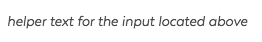
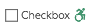

# Forms

## Helper Text



This pattern is used as Helper text for a form input

### Status {#status}

* Stable as of 5.0.0

### Usage Guidelines {#usage-guidelines}

* the `inputId` value should match the id of the related input.

### Variables {#variables}

```text
helperText: {  inputId:    type: string / required.  message:    type: string / required
```



```text
<label
  for="GUID2738572489"
  aria-labelledby="GUID2738572489"
  class="ma__helper-text">helper text for the input located above</label>
```



```text
<label
  for="{{ helperText.inputId }}"
  aria-labelledby="{{ helperText.inputId }}"
  class="ma__helper-text">{{ helperText.message }}</label>
```



## 6/22/17

updated spacing of \_\_\_\_\_\_\_\_\_

## 6/01/17

changed font to \_\_\_\_\_\_\_\_



## Input Checkbox





This is a stylized checkbox with a label and an optional icon.

### Status

* Stable as of 5.0.0

### Variables

```text
inputCheckbox {
  value:
    type: string / required
  id:
    type: string / required
  icon:
    type: string (path to icon) / optional
  label:
    type: string / required
  checked:
    type: boolean
}
```

The **input checkbox** pattern is included in the following patterns: [atoms-input-group-checkbox-inline](https://mayflower.digital.mass.gov/patternlab/patterns/01-atoms-03-forms-input-group-checkbox-inline/01-atoms-03-forms-input-group-checkbox-inline.html), [atoms-input-group-checkbox](https://mayflower.digital.mass.gov/patternlab/patterns/01-atoms-03-forms-input-group-checkbox/01-atoms-03-forms-input-group-checkbox.html), [atoms-input-group-radio-inline](https://mayflower.digital.mass.gov/patternlab/patterns/01-atoms-03-forms-input-group-radio-inline/01-atoms-03-forms-input-group-radio-inline.html), [atoms-input-group](https://mayflower.digital.mass.gov/patternlab/patterns/01-atoms-03-forms-input-group/01-atoms-03-forms-input-group.html),[molecules-location-filters](https://mayflower.digital.mass.gov/patternlab/patterns/02-molecules-location-filters/02-molecules-location-filters.html), [organisms-transition-page](https://mayflower.digital.mass.gov/patternlab/patterns/03-organisms-by-template-transition-page/03-organisms-by-template-transition-page.html)



```text
<span class="ma__input-checkbox">
  <input type="checkbox" value="checkbox" id="checkbox-test" checked>
      <svg aria-hidden="true"><use xlink:href="#ccc500f42654fb1e40bf42ad9e0bebcd.0"></use></svg><svg xmlns="http://www.w3.org/2000/svg" style="display: none"><symbol xmlns="http://www.w3.org/2000/svg" aria-hidden="true" version="1.1" viewBox="0 0 31 40" id="ccc500f42654fb1e40bf42ad9e0bebcd.0"><path d="M1311.33 360.136C1310.86 359.644 1310.1899999999998 359.38500000000005 1309.51 359.422L1301.29 359.88300000000004L1305.81 354.69000000000005C1306.46 353.95000000000005 1306.6399999999999 352.96400000000006 1306.3899999999999 352.083C1306.2599999999998 351.47900000000004 1305.8999999999999 350.92900000000003 1305.34 350.57800000000003C1305.32 350.56600000000003 1294.53 344.244 1294.53 344.244C1293.6499999999999 343.728 1292.53 343.84200000000004 1291.77 344.526L1286.5 349.26800000000003C1285.53 350.141 1285.44 351.64300000000003 1286.31 352.62300000000005C1287.1799999999998 353.60200000000003 1288.6699999999998 353.68800000000005 1289.6399999999999 352.814L1293.6399999999999 349.219L1296.9399999999998 351.154L1291.11 357.852C1288.6899999999998 358.25 1286.51 359.37399999999997 1284.8 360.99399999999997L1287.85 364.065C1289.23 362.803 1291.05 362.032 1293.06 362.032C1297.33 362.032 1300.81 365.53799999999995 1300.81 369.846C1300.81 371.866 1300.05 373.71 1298.8 375.098L1301.84 378.16900000000004C1303.87 375.994 1305.12 373.06800000000004 1305.12 369.84600000000006C1305.12 367.9270000000001 1304.6799999999998 366.1120000000001 1303.8899999999999 364.49800000000005L1307.07 364.3190000000001L1306.3 373.8900000000001C1306.19 375.1980000000001 1307.1599999999999 376.3450000000001 1308.46 376.4520000000001C1308.52 376.4570000000001 1308.5900000000001 376.4590000000001 1308.65 376.4590000000001C1309.8700000000001 376.4590000000001 1310.9 375.51800000000014 1311 374.2760000000001L1311.99 361.9880000000001C1312.05 361.3030000000001 1311.81 360.6280000000001 1311.33 360.13600000000014ZM1306.96 349.956C1309.14 349.956 1310.91 348.175 1310.91 345.978C1310.91 343.781 1309.14 342 1306.96 342C1304.78 342 1303.02 343.781 1303.02 345.978C1303.02 348.175 1304.78 349.956 1306.96 349.956ZM1293.06 377.66C1288.78 377.66 1285.31 374.15500000000003 1285.31 369.846C1285.31 368.223 1285.8 366.713 1286.6399999999999 365.462L1283.56 362.358C1281.96 364.422 1281 367.021 1281 369.846C1281 376.559 1286.4 382 1293.06 382C1295.86 382 1298.44 381.033 1300.49 379.415L1297.41 376.31100000000004C1296.17 377.16200000000003 1294.67 377.66 1293.0600000000002 377.66Z " fill-opacity="1" transform="matrix(1,0,0,1,-1281,-342)"/></symbol></svg>
    <label for="checkbox-test"><span>Checkbox</span></label>
</span>
```

Checkbox



```text
{# backward compatible for v5.1 #}

  


<span class="ma__input-checkbox">
  <input type="checkbox" value="{{ inputCheckbox.value }}" id="{{ inputCheckbox.id }}" {{ inputCheckbox.checked ? 'checked' : '' }}>
  
    {{ icon(inputCheckbox.icon) }}
  
  <label for="{{ inputCheckbox.id }}"><span>{{ inputCheckbox.label}}</span></label>
</span>
```



## Input Date

## Text input \(optional\)





This is a variant of the [Input Text](https://mayflower.digital.mass.gov/patternlab/patterns/01-atoms-03-forms/?p=atoms-input-text) pattern showing an example of an optional input.

### How to generate

* set the `required` variable to false

The **input text as optional** pattern contains the following patterns:

The **input text as optional** pattern is included in the following patterns: [atoms-input-text-as-error](https://mayflower.digital.mass.gov/patternlab/patterns/01-atoms-03-forms-input-text-as-error/01-atoms-03-forms-input-text-as-error.html), [molecules-event-filters](https://mayflower.digital.mass.gov/patternlab/patterns/02-molecules-event-filters/02-molecules-event-filters.html), [molecules-location-filters](https://mayflower.digital.mass.gov/patternlab/patterns/02-molecules-location-filters/02-molecules-location-filters.html),[molecules-search-banner-form](https://mayflower.digital.mass.gov/patternlab/patterns/02-molecules-search-banner-form/02-molecules-search-banner-form.html), [organisms-feedback-form](https://mayflower.digital.mass.gov/patternlab/patterns/03-organisms-by-author-feedback-form/03-organisms-by-author-feedback-form.html)



```text
<label
  for="optional-input"
  class="ma__label ma__label--optional ">Text Input</label>
<input
  class="ma__input "
  name="optional-input"
  id="optional-input"
  type="text"
  placeholder="Optional input"
  data-type="text"
         />
```



```text
Twig
HTML


  <label
  for="{{ inputText.id }}"
  class="ma__label {{ inputText.required ? 'ma__label--required' : 'ma__label--optional'}} {{ inputText.hiddenLabel ? 'ma__label--hidden' : '' }}">{{inputText.labelText}}</label>


  <div class="ma__error-msg">{{ inputText.errorMsg }}</div>

<input
  class="ma__input {{ inputText.required ? 'js-is-required' : ''}}"
  name="{{ inputText.name }}"
  id="{{ inputText.id }}"
  type="{{ inputText.type }}"
  placeholder="{{ inputText.placeholder }}"
  data-type="{{ inputText.type }}"
  
    maxlength="{{ inputText.maxlength }}"
  
  
    pattern="{{ inputText.pattern }}*"
  
  
    style="width: {{ inputText.width }}px"
  
  {{ inputText.required ? 'required' : '' }} />
```



## Test

