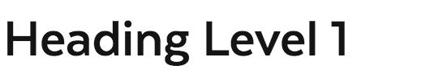
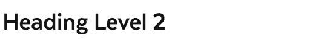
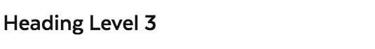
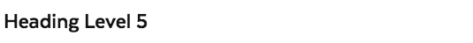
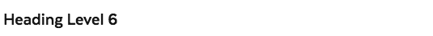
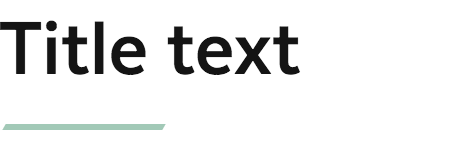
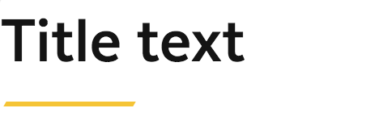
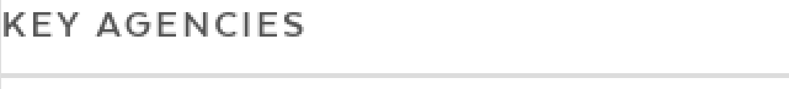

# Headings

## Overview

Headings are used as the titles of each major section of a page in the interface.

### Heading Types

#### Heading Level Variations

These elements represent headings for their sections...These elements have a rank given by the number in their name. The `<h1>` element is said to have the highest rank, the `<h6>` element has the lowest rank, and two elements with the same name have equal rank.

Navigating through the `<h1>` and `<h2>` elements allows the user to understand the overall purpose of a page and how its content is structured. The `<h3>`through `<h6>` elements provide a quick understanding of the details in each section.

| **Visual** | **Name** | Screen Size \(px\) | Base Font Size \(px\) | Font Size \(rem\) | **Font Size \(px\)** | Line Height | Line Height \(px\) |
| :--- | :--- | :--- | :--- | :--- | :--- | :--- | :--- |
|  | H1 | &gt;= 1200 | 16px | 3.5rem | 56px | 1.07 | 59.92px |
|  |  | 780 ~ 1200 | 16px | 3.25rem | 52px | 1.07 | 55.64px |
|  |  | 620 ~ 780 | 16px | 3rem | 48px | 1.07 | 51.36px |
|  |  | &lt;= 620 | 14.5px | 3rem | 43.5px | 1.07 | 46.545px |
|  | H2 | Above 620px | 16px | 2.5rem | 40px | 1.2 | 48px |
|  |  | Below 620px | 14.5px | 2.5rem | 36.25px | 1.2 | 43.5px |
|  | H3 | Above 620px | 16px | 2.125rem | 34px | 1.2 | 40.8px |
|  |  | Below 620px | 14.5px | 2.125rem | 30.8125px | 1.2 | 36.975px |
|  | H4 | Above 620px | 16px | 1.875rem | 30px | 1.2 | 36px |
|  |  | Below 620px | 14.5px | 1.875rem | 27.1875px | 1.2 | 32.625px |
|  | H5 | Above 620px | 16px | 1.625rem | 26px | 1.3 | 33.8px |
|  |  | Below 620px | 14.5px | 1.625rem | 23.5625px | 1.3 | 30.63125px |
|  | H6 | Above 620px | 16px | 1.375rem | 22px | 1.4 | 30.8px |
|  |  | Below 620px | 14.5px | 1.375rem | 19.9375px | 1.4 | 27.9125px |

#### Colored Heading Variations

| **Visual** | **Name** | **Description & Usage** |
| :--- | :--- | :--- |
|  | Colored Heading \(Primary Alt\) | Should be used as a navigational heading, high up on the page. It's used as section heading for action finders on organization page. If a page heading H1 exists, should use a lower heading level than the page heading. Color is for styling purposes no semantic differences. |
|  | Colored Heading \(Primary\) | Should be used as a navigational heading, high up on the page. It's used as section heading for action finders on services page. |
|  | Colored Heading | Should only be used in the right rail when there is a green colored navigational heading in the 2/3rds main content well. |

#### Component Heading Variations

| **Visual** | **Name** | **Description & Usage** |
| :--- | :--- | :--- |
|  | Component Heading | Should be used to to separate content within a big section. If used under Colored Heading, should use a lower heading level than the colored heading. |
|  | Component Heading \(Highlight\) |  |

#### Sidebar Heading Variations

| **Visual** | **Name** | **Description & Usage** |
| :--- | :--- | :--- |
|  | Sidebar Heading | Should be used as a heading of a list either full width or in a 50/50 split the main content well. |

### Accessibility & Best Practices

* Headings should not be used to convey style items
* Headings must be hierarchical and properly nested \(all h2’s within an h1 etc\) so as to maintain proper navigability for low or non-sighted users

## Code

### Heading Levels 1-6



```markup
<h1>Heading Level 1</h1>
<h2>Heading Level 2</h2>
<h3>Heading Level 3</h3>
<h4>Heading Level 4</h4>
<h5>Heading Level 5</h5>
<h6>Heading Level 6</h6>
```



[Heading Levels 1-6 in Storybook](https://mayflower.digital.mass.gov/react/?knob-text=Title%20text&knob-level=1&selectedKind=atoms%2Fheadings&selectedStory=Heading)



[Heading Levels 1-6 Pattern Lab](https://mayflower.digital.mass.gov/patternlab/?p=atoms-heading-1)



### Colored Heading



```markup
<h2 class="ma__colored-heading">
  Colored Heading
</h2>
```



[Grey Colored Heading in Storybook](https://mayflower.digital.mass.gov/react/?knob-text=Title%20text&knob-level=1&knob-coloredHeading.text=Title%20text&knob-coloredHeading.level=2&selectedKind=atoms%2Fheadings&selectedStory=ColoredHeading&full=0&addons=1&stories=1&panelRight=0&addonPanel=storybook%2Factions%2Factions-panel)



[Grey Colored Heading in Pattern Lab](https://mayflower.digital.mass.gov/patternlab/?p=atoms-colored-heading)



#### Colored Heading \(Primary Alt\)



```markup
<h2 class="ma__colored-heading ma__colored-heading--green">
  Colored Heading
</h2>
```



[Green Colored Heading in Storybook](https://mayflower.digital.mass.gov/react/?knob-text=Title%20text&knob-level=1&knob-coloredHeading.text=Title%20text&knob-coloredHeading.level=2&knob-coloredHeading.color=green&selectedKind=atoms%2Fheadings&selectedStory=ColoredHeading&full=0&addons=1&stories=1&panelRight=0&addonPanel=storybooks%2Fstorybook-addon-knobs)



[Green Colored Heading in Pattern Lab](https://mayflower.digital.mass.gov/patternlab/?p=atoms-colored-heading-green)



#### Colored Heading \(Primary\)



```markup
<h2 class="ma__colored-heading ma__colored-heading--blue">
  Colored Heading
</h2>
```



[Blue Colored Heading in Storybook](https://mayflower.digital.mass.gov/react/?knob-text=Title%20text&knob-level=1&knob-coloredHeading.text=Title%20text&knob-coloredHeading.level=2&knob-coloredHeading.color=blue&selectedKind=atoms%2Fheadings&selectedStory=ColoredHeading&full=0&addons=1&stories=1&panelRight=0&addonPanel=storybooks%2Fstorybook-addon-knobs)



[Blue Colored Heading in Pattern Lab](https://mayflower.digital.mass.gov/patternlab/?p=atoms-colored-heading-blue)



### Component Heading



```markup
<h2 class="ma__comp-heading" tabindex="-1">
  Title text
</h2>
```



[Component Heading in Storybook](https://mayflower.digital.mass.gov/react/?knob-coloredHeading.text=Title%20text&knob-text=Title%20text&knob-compHeading.title=Title%20text&knob-compHeading.titleContext=&knob-coloredHeading.color=blue&knob-compHeading.id=&knob-level=1&knob-coloredHeading.level=2&knob-compHeading.color=&knob-compHeading.level=2&selectedKind=atoms%2Fheadings&selectedStory=Comp%20Heading&full=0&addons=1&stories=1&panelRight=0&addonPanel=storybooks%2Fstorybook-addon-knobs)



[Component Heading in Pattern Lab](https://mayflower.digital.mass.gov/patternlab/?p=atoms-comp-heading)



### Column Heading



```markup
<h3 class="ma__column-heading">
  Heading for the start of a column
</h3>
```



Not Available



[Column Heading in Pattern Lab](https://mayflower.digital.mass.gov/patternlab/?p=atoms-column-heading)



### Sidebar Heading



```markup
<h2 class="ma__sidebar-heading">
  Key Agencies
</h2>
```



[Sidebar Heading in Storybook](https://mayflower.digital.mass.gov/react/?knob-coloredHeading.text=Title%20text&knob-text=Title%20text&knob-compHeading.title=Title%20text&knob-sidebarHeading.title=Key%20Agencies&knob-compHeading.titleContext=&knob-coloredHeading.color=blue&knob-compHeading.id=&knob-level=1&knob-coloredHeading.level=2&knob-compHeading.color=&knob-compHeading.level=2&knob-sidebarHeading.level=2&selectedKind=atoms%2Fheadings&selectedStory=SidebarHeading&full=0&addons=1&stories=1&panelRight=0&addonPanel=storybooks%2Fstorybook-addon-knobs)



[Sidebar Heading in Pattern Lab](https://mayflower.digital.mass.gov/patternlab/?p=atoms-sidebar-heading)



## Style

### Classnames

| **Name** | **Class Modifier** |
| :--- | :--- |
| Colored Heading | `.ma__colored-heading` |
| Colored Heading \(Primary Alt\) | `.ma__colored-heading--c-primary-alt`\(_work in progress_\) `.ma__colored-heading--green` \(_previous version_\) |
| Colored Heading \(Primary\) | `.ma__colored-heading--c-primary`\(_work in progress_\)`.ma__colored-heading--blue` \(_previous version_\) |
| Component Heading | `.ma__comp-heading` |
| Component Heading \(Highlight\) | `.ma__comp-heading--c-highlight` \(_work in progress_\)`.ma__comp-heading--yellow` \(previous version\) |
| Sidebar Heading | `.ma__sidebar-heading` |

