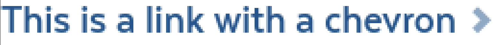

# Links

## Overview

Links are used to embed actions or pathways to more information in a sentence or on a page.

### Link Variations

| **Visual** | **Name** | **Description & Usage** |
| :--- | :--- | :--- |
|  | Link | Use when you are linking just a few words of text or when you are doing inline links. |
|  | Decorative Link | Used for standalone links that require more emphasis. |
|  | Chevron Link |  |
|  | Link Button | Refer to [Link Button](buttons.md#link-button) in the [Buttons](buttons.md) section. |

### Accessibility & Best Practices

The purpose of a link can be determined from the link text alone or from the text combined with programmatically determined content

* The largest errors usually found here are on article preview links or similar where there may be multiple links on a page stating “read more” or other similar repeatable text, this should be avoided.
* Additionally links that are not links but items such as files, e-mail to links and phone numbers should be clearly labeled as such

## Code

### Link



```markup
<a class="ma__content-link" href="#" title="">
  <span>This is a link</span>
</a>
```



Currently Not Available



[Link in Pattern Lab](https://mayflower.digital.mass.gov/?p=atoms-link)



### Decorative Link



```markup
<span class="ma__decorative-link">
  <a href="#" class="js-clickable-link" title="">
    Lorem ipsum dolor sit amet.&nbsp;
    <svg aria-hidden="true"><use xlink:href="#5d998bcb4a89b79d90516730de26bc4b.3"></use></svg><svg xmlns="http://www.w3.org/2000/svg" style="display: none"><symbol xmlns="http://www.w3.org/2000/svg" aria-hidden="true" version="1.1" viewBox="0 0 16 18" id="5d998bcb4a89b79d90516730de26bc4b.3"><path d="M983.721 1887.28L983.721 1887.28L986.423 1890L986.423 1890L986.423 1890L983.721 1892.72L983.721 1892.72L978.318 1898.17L975.617 1895.45L979.115 1891.92L971.443 1891.92L971.443 1888.0700000000002L979.103 1888.0700000000002L975.617 1884.5500000000002L978.318 1881.8300000000002Z " transform="matrix(1,0,0,1,-971,-1881)"/></symbol></svg>
  </a>
</span>
```



[Decorative Link in Storybook](https://mayflower.digital.mass.gov/react/?selectedKind=atoms%2Flinks&selectedStory=DecorativeLink&full=0&addons=1&stories=1&panelRight=0&addonPanel=storybooks%2Fstorybook-addon-knobs)



[Decorative Link in Pattern Lab](https://mayflower.digital.mass.gov/?p=atoms-decorative-link)



### Chevron Link



```markup
<a class="ma__content-link ma__content-link--chevron" href="#" title="">
  <span>This is a link with a chevron</span>
</a>
```



Currently Not Available



[Chevron Link in Pattern Lab](https://mayflower.digital.mass.gov/?p=atoms-link-chevron)



## Style

### Classnames

| **Name** | **Class Modifiers** |
| :--- | :--- |
| Link | `.ma__content-link` |
| Decorative Link | `.ma__decorative--link` |
| Chevron Link | `.ma__content-link--chevron` |

