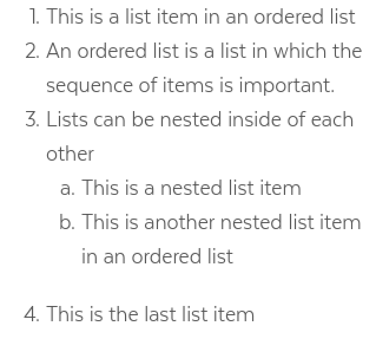
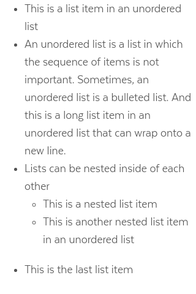

# Lists

## Overview

Lists display a series of related content. Each list item begins with a bullet or a number.

### List Types

| **Visual** | **Name** | Description & Usage |
| :--- | :--- | :--- |
|  | Ordered List | Use ordered lists to group a set of items in a prioritized or step by step sequence.. |
|  | Unordered List | Use unordered lists to group shortened content of the same status or value. |

### Accessibility & Best Practices

## Code

### Ordered List



```markup
<ol>
  <li>This is a list item in an ordered list
  <li>An ordered list is a list in which the sequence of items is important. Top level item counters are digits
  <li>
    Lists can be nested inside of each other
    <ol>
      <li>This is a nested list item. After digits list items counters are lower-alpha.
      </li>
      <li>
        This is another nested list item in an ordered list
        <ol>
          <li>
            This is a nested list item. After lower-alpha counters, lower-roman counters are used.
            <ol>
              <li>This is a nested list item. After lower-roman counters, the counters loop back to digits.</li>
              <li>This is another nested list item in an ordered list</li>
            </ol>
          </li>
          <li>This is another nested list item in an ordered list
          </li>
        </ol>
      </li>
    </ol>
  </li>
  <li>This is the last list item
</ol>
```



[Ordered List in React](https://mayflower.digital.mass.gov/react/?knob-href=%23&knob-info=&knob-List%20Item%200=This%20is%20a%20list%20item%20in%20an%20ordered%20list&knob-List%20Item%201=An%20ordered%20list%20is%20a%20list%20in%20which%20the%20sequence%20of%20items%20is%20important.&knob-List%20Item%202=Lists%20can%20be%20nested%20inside%20of%20each%20other&knob-List%20Item%203=This%20is%20the%20last%20list%20item&knob-Sub%20Item%200=This%20is%20a%20nested%20list%20item&knob-Sub%20Item%201=This%20is%20another%20nested%20list%20item%20in%20an%20ordered%20list&knob-linkText=Lorem%20ipsum%20dolor%20sit%20amet&selectedKind=atoms%2Flists&selectedStory=OrderedList&full=0&addons=1&stories=1&panelRight=0&addonPanel=storybooks%2Fstorybook-addon-knobs)



[Ordered List in Pattern Lab](https://mayflower.digital.mass.gov/patternlab/?p=atoms-ordered-list)



### Unordered List



```markup
<ul>
  <li>This is a list item in an unordered list</li>
  <li>An unordered list is a list in which the sequence of items is not important. Sometimes, an unordered list is a bulleted list. And this is a long list item in an unordered list that can wrap onto a new line.</li>
  <li>Lists can be nested inside of each other</li>
  <ul>
    <li>This is a nested list item</li>
    <li>This is another nested list item in an unordered list</li>
  </ul>
  <li>This is the last list item</li>
</ul>
```



[Unordered List in Storybook](https://mayflower.digital.mass.gov/react/?knob-href=%23&knob-info=&knob-List%20Item%200=This%20is%20a%20list%20item%20in%20an%20unordered%20list&knob-List%20Item%201=An%20unordered%20list%20is%20a%20list%20in%20which%20the%20sequence%20of%20items%20is%20not%20important.%20Sometimes%2C%20an%20unordered%20list%20is%20a%20bulleted%20list.%20And%20this%20is%20a%20long%20list%20item%20in%20an%20unordered%20list%20that%20can%20wrap%20onto%20a%20new%20line.&knob-List%20Item%202=Lists%20can%20be%20nested%20inside%20of%20each%20other&knob-List%20Item%203=This%20is%20the%20last%20list%20item&knob-Sub%20Item%200=This%20is%20a%20nested%20list%20item&knob-Sub%20Item%201=This%20is%20another%20nested%20list%20item%20in%20an%20unordered%20list&knob-linkText=Lorem%20ipsum%20dolor%20sit%20amet&selectedKind=atoms%2Flists&selectedStory=UnorderedList&full=0&addons=1&stories=1&panelRight=0&addonPanel=storybooks%2Fstorybook-addon-knobs)



[Unordered List in Pattern Lab](https://mayflower.digital.mass.gov/patternlab/?p=atoms-unordered-list)



## Style

