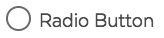
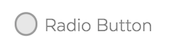

# Radio Button

## Overview

Radio buttons are generally presented in groups \(a collection of radio buttons describing a set of related options\) when the user must make only one selection out of a group of items.

Only one radio button in a given group can be selected at the same time, whereas checkboxes let the user turn individual values on and off. Where multiple controls exist, checkboxes allow multiple values to be selected.

This is a unit to present a radio button. Each radio button needs its label to describe what the radio button is for for the user.

### Radio Button States

| Visual | Name | Description |
| :--- | :--- | :--- |
|  | Standard |  |
|  | Checked |  |
|  | Disabled |  |
|  | Error |  |
|  | Focus |  |

### Accessibility & Best Practices

Pairing the radio button with the label is crucial for usability and accessibility.

#### Label

The label describes the radio button.

`for` attribute with its matching value to the `id` value of the radio button assigns the label to the radio button as a pair.

A benefit of using labels is that the user can click on the label itself to set focus to the form element. This is useful to some with motor disabilities, particularly when selecting small checkboxes and radio buttons. You can try this by clicking on the word "Name:" above to see focus set to the text box. Clicking adjacent labels provides an easy way to check for proper form labeling.

#### Radio button

Its `id` attribute identifies the radio button as a unique element in the page. Ensure the `id` value is unique in the page.

A grouped options share a common value for their `name` attribute.

## Code



```markup
<span class="ma__input-radio">
  <input name="radio-test" type="radio" value="radio-button" id="radio-test" checked>
  <label for="radio-test"><span>Radio Button</span></label>
</span>
```



Currently Not Available



```php

  

```



## Style

### Classnames

| Name | Class Modifier |
| :--- | :--- |
| Base Radio Button | `.ma__input-radio` |
| Radio Button with Error | `.ma__input-radio--error` \(_work in progress_\) |
| Radio Button Disabled | `.ma__input-radio--disabled` \(_work in progress_\) |

