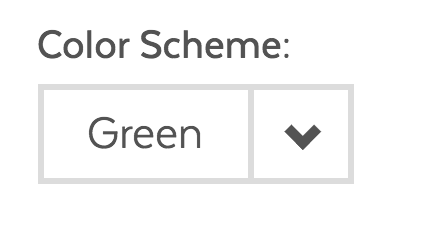
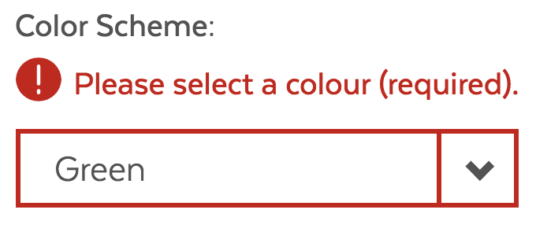
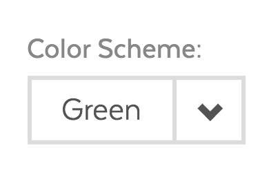
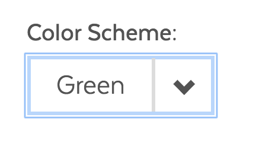
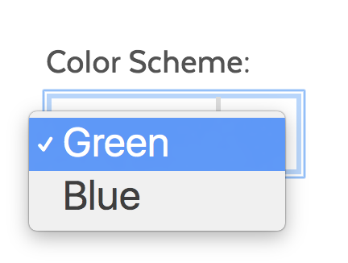

# Select Box

## Overview

Select box is a common form component used when only a single option should be selected from a list of possibilities. The select box should be used if you are constrained by space or if you have more than 3 and less than 10 selectable options. A group of radio buttons is preferred if you are able to show all available options to users. If you have a large number of selectable options, users should be able provided with typeahead functionality \(see input text typeahead\).

#### Disclaimer

Select boxes should not be used if possible. The behavior of select boxes varies across devices and they are not intuitive to non-technical users. Better options with comparable functionality are text inputs or a group of radio buttons.

### Select Box States

| Visual | Name | Description |
| :--- | :--- | :--- |
|  | Standard |  |
|  | Error |  |
|  | Disabled |  |
|  | Focus |  |
|  | Active |  |

### Accessibility & Best Practices

* Options should be sorted in a logical manner.
* Create simple, clear, and relevant options.
* Provide a clear label.

## Code



[SelectBox in React Storybook](https://mayflower.digital.mass.gov/react/?knob-href=%23&knob-info=&knob-selectBox.defaultSelected=Green&knob-selectBox.options=[{"text"%3A"Green"%2C"value"%3A"green"}%2C{"text"%3A"Blue"%2C"value"%3A"blue"}]&knob-selectBox.className=ma__select-box%20js-dropdown&knob-List%20Item%200=This%20is%20a%20list%20item%20in%20an%20unordered%20list&knob-tableOptions.feeTable={"head"%3A{"rows"%3A[{"rowSpanOffset"%3Afalse%2C"cells"%3A[{"heading"%3Afalse%2C"colspan"%3A""%2C"rowspan"%3A""%2C"text"%3A"Type"}%2C{"heading"%3Atrue%2C"colspan"%3A""%2C"rowspan"%3A""%2C"text"%3A"Name"}%2C{"heading"%3Atrue%2C"colspan"%3A""%2C"rowspan"%3A""%2C"text"%3A"Fee"}]}]}%2C"bodies"%3A[{"rows"%3A[{"rowSpanOffset"%3Afalse%2C"cells"%3A[{"heading"%3Atrue%2C"colspan"%3A""%2C"rowspan"%3A"4"%2C"text"%3A"Freshwater%20Fishing"}%2C{"heading"%3Afalse%2C"colspan"%3A""%2C"rowspan"%3A""%2C"text"%3A"Resident%20Citizen%20or%20Non-Resident%20Fishing"}%2C{"heading"%3Afalse%2C"colspan"%3A""%2C"rowspan"%3A""%2C"text"%3A"%2427.50"}]}%2C{"rowSpanOffset"%3Atrue%2C"cells"%3A[{"heading"%3Afalse%2C"colspan"%3A""%2C"rowspan"%3A""%2C"text"%3A"Resident%20Citizen%20or%20Non-Resident%20Minor%20Fishing%20%28Age%2015-17%29"}%2C{"heading"%3Afalse%2C"colspan"%3A""%2C"rowspan"%3A""%2C"text"%3A"FREE"}]}%2C{"rowSpanOffset"%3Atrue%2C"cells"%3A[{"heading"%3Afalse%2C"colspan"%3A""%2C"rowspan"%3A""%2C"text"%3A"Resident%20Citizen%20Fishing%20%28Age%2065-69%29"}%2C{"heading"%3Afalse%2C"colspan"%3A""%2C"rowspan"%3A""%2C"text"%3A"%2416.25"}]}%2C{"rowSpanOffset"%3Atrue%2C"cells"%3A[{"heading"%3Afalse%2C"colspan"%3A""%2C"rowspan"%3A""%2C"text"%3A"Resident%20Citizen%20Fishing%20%28Aged%2070%20or%20Over%29"}%2C{"heading"%3Afalse%2C"colspan"%3A""%2C"rowspan"%3A""%2C"text"%3A"FREE"}]}]}%2C{"rows"%3A[{"rowSpanOffset"%3Afalse%2C"cells"%3A[{"heading"%3Atrue%2C"colspan"%3A""%2C"rowspan"%3A"4"%2C"text"%3A"Hunting"}%2C{"heading"%3Afalse%2C"colspan"%3A""%2C"rowspan"%3A""%2C"text"%3A"Resident%20Citizen%20Hunting"}%2C{"heading"%3Afalse%2C"colspan"%3A""%2C"rowspan"%3A""%2C"text"%3A"%2427.50"}]}%2C{"rowSpanOffset"%3Atrue%2C"cells"%3A[{"heading"%3Afalse%2C"colspan"%3A""%2C"rowspan"%3A""%2C"text"%3A"Resident%20Citizen%20Hunting%2C%20%28Age%2065-69%29"}%2C{"heading"%3Afalse%2C"colspan"%3A""%2C"rowspan"%3A""%2C"text"%3A"%2416.25"}]}%2C{"rowSpanOffset"%3Atrue%2C"cells"%3A[{"heading"%3Afalse%2C"colspan"%3A""%2C"rowspan"%3A""%2C"text"%3A"Resident%20and%20Non-Resident%20Citizen%20Hunting"}%2C{"heading"%3Afalse%2C"colspan"%3A""%2C"rowspan"%3A""%2C"text"%3A"FREE"}]}%2C{"rowSpanOffset"%3Atrue%2C"cells"%3A[{"heading"%3Afalse%2C"colspan"%3A""%2C"rowspan"%3A""%2C"text"%3A"Resident%20Hunting"}%2C{"heading"%3Afalse%2C"colspan"%3A""%2C"rowspan"%3A""%2C"text"%3A"%2427.50"}]}]}]}&knob-List%20Item%201=An%20unordered%20list%20is%20a%20list%20in%20which%20the%20sequence%20of%20items%20is%20not%20important.%20Sometimes%2C%20an%20unordered%20list%20is%20a%20bulleted%20list.%20And%20this%20is%20a%20long%20list%20item%20in%20an%20unordered%20list%20that%20can%20wrap%20onto%20a%20new%20line.&knob-List%20Item%202=Lists%20can%20be%20nested%20inside%20of%20each%20other&knob-selectBox.id=color-select&knob-List%20Item%203=This%20is%20the%20last%20list%20item&knob-selectBox.required=true&knob-Sub%20Item%200=This%20is%20a%20nested%20list%20item&knob-Sub%20Item%201=This%20is%20another%20nested%20list%20item%20in%20an%20unordered%20list&knob-linkText=Lorem%20ipsum%20dolor%20sit%20amet&knob-selectBox.label=Color%20Scheme%3A&selectedKind=atoms%2Fforms&selectedStory=SelectBox&full=0&addons=1&stories=1&panelRight=0&addonPanel=storybooks%2Fstorybook-addon-knobs)



[SelectBox in Pattern Lab](https://mayflower.digital.mass.gov/patternlab/?p=atoms-select-box)



## Style

### Classnames

| Name | Class Modifier |
| :--- | :--- |
| Standard | `.ma__select-box__field` |
| Disabled | `.ma__select-box__field--disabled` |
| Inline | `.ma__select-box__field--inline` |
| Error | `.ma__select-box__field--error` \(_work in progress_\) `.has-error` \(_previous version_\) |

