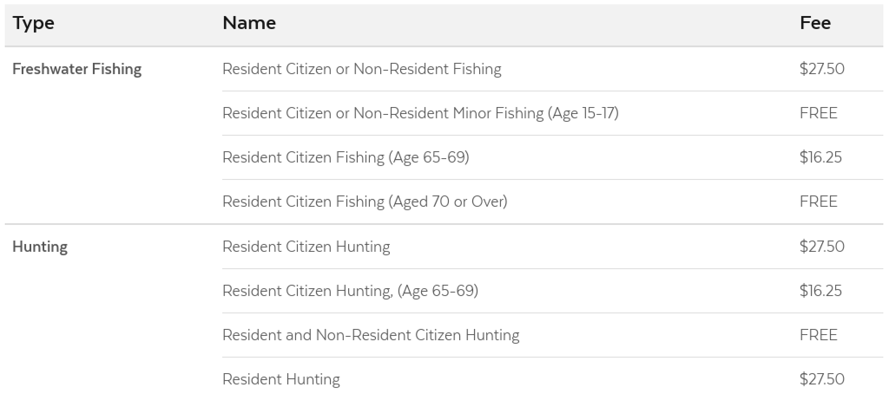

# Table

## Overview

Tables should only be used to present raw data sets, to make content easy to scan and compare. If used for non-tabular data, this will not adhere to accessibility guidelines. A good example of using a table is to display fee data. Tables outside of rich text editors are responsive, and at smaller screen sizes, the columns and rows stack, turning into a list. Rich text tables have overflow turned on and will scroll on smaller screens.



### Accessibility & Best Practices

## Code



```markup
<table class="ma__table ">
  <thead>
    <tr>
      <th scope="col">Type</th>
      <th scope="col">Name</th>
      <th scope="col">Fee</th>
    </tr>
  </thead>
  <tbody>
    <tr>
      <th data-label="Type" scope="row" rowspan="4">Freshwater Fishing</th>
      <td data-label="Name">Resident Citizen or Non-Resident Fishing</td>
      <td data-label="Fee">$27.50</td>
    </tr>
    <tr class="is-offset">
      <td data-label="Name">Resident Citizen or Non-Resident Minor Fishing (Age 15-17)</td>
      <td data-label="Fee">FREE</td>
    </tr>
    <tr class="is-offset">
      <td data-label="Name">Resident Citizen Fishing (Age 65-69)</td>
      <td data-label="Fee">$16.25</td>
    </tr>
    <tr class="is-offset">
      <td data-label="Name">Resident Citizen Fishing (Aged 70 or Over)</td>
      <td data-label="Fee">FREE</td>
    </tr>
  </tbody>
  <tbody>
    <tr>
      <th data-label="Type" scope="row" rowspan="4">Hunting</th>
      <td data-label="Name">Resident Citizen Hunting</td>
      <td data-label="Fee">$27.50</td>
    </tr>
    <tr class="is-offset">
      <td data-label="Name">Resident Citizen Hunting, (Age 65-69)</td>
      <td data-label="Fee">$16.25</td>
    </tr>
    <tr class="is-offset">
      <td data-label="Name">Resident and Non-Resident Citizen Hunting</td>
      <td data-label="Fee">FREE</td>
    </tr>
    <tr class="is-offset">
      <td data-label="Name">Resident Hunting</td>
      <td data-label="Fee">$27.50</td>
    </tr>
  </tbody>
</table>
```



[Table in Storybook](https://mayflower.digital.mass.gov/react/?knob-href=%23&knob-info=&knob-List%20Item%200=This%20is%20a%20list%20item%20in%20an%20unordered%20list&knob-tableOptions.feeTable={"head"%3A{"rows"%3A[{"rowSpanOffset"%3Afalse%2C"cells"%3A[{"heading"%3Afalse%2C"colspan"%3A""%2C"rowspan"%3A""%2C"text"%3A"Type"}%2C{"heading"%3Atrue%2C"colspan"%3A""%2C"rowspan"%3A""%2C"text"%3A"Name"}%2C{"heading"%3Atrue%2C"colspan"%3A""%2C"rowspan"%3A""%2C"text"%3A"Fee"}]}]}%2C"bodies"%3A[{"rows"%3A[{"rowSpanOffset"%3Afalse%2C"cells"%3A[{"heading"%3Atrue%2C"colspan"%3A""%2C"rowspan"%3A"4"%2C"text"%3A"Freshwater%20Fishing"}%2C{"heading"%3Afalse%2C"colspan"%3A""%2C"rowspan"%3A""%2C"text"%3A"Resident%20Citizen%20or%20Non-Resident%20Fishing"}%2C{"heading"%3Afalse%2C"colspan"%3A""%2C"rowspan"%3A""%2C"text"%3A"%2427.50"}]}%2C{"rowSpanOffset"%3Atrue%2C"cells"%3A[{"heading"%3Afalse%2C"colspan"%3A""%2C"rowspan"%3A""%2C"text"%3A"Resident%20Citizen%20or%20Non-Resident%20Minor%20Fishing%20%28Age%2015-17%29"}%2C{"heading"%3Afalse%2C"colspan"%3A""%2C"rowspan"%3A""%2C"text"%3A"FREE"}]}%2C{"rowSpanOffset"%3Atrue%2C"cells"%3A[{"heading"%3Afalse%2C"colspan"%3A""%2C"rowspan"%3A""%2C"text"%3A"Resident%20Citizen%20Fishing%20%28Age%2065-69%29"}%2C{"heading"%3Afalse%2C"colspan"%3A""%2C"rowspan"%3A""%2C"text"%3A"%2416.25"}]}%2C{"rowSpanOffset"%3Atrue%2C"cells"%3A[{"heading"%3Afalse%2C"colspan"%3A""%2C"rowspan"%3A""%2C"text"%3A"Resident%20Citizen%20Fishing%20%28Aged%2070%20or%20Over%29"}%2C{"heading"%3Afalse%2C"colspan"%3A""%2C"rowspan"%3A""%2C"text"%3A"FREE"}]}]}%2C{"rows"%3A[{"rowSpanOffset"%3Afalse%2C"cells"%3A[{"heading"%3Atrue%2C"colspan"%3A""%2C"rowspan"%3A"4"%2C"text"%3A"Hunting"}%2C{"heading"%3Afalse%2C"colspan"%3A""%2C"rowspan"%3A""%2C"text"%3A"Resident%20Citizen%20Hunting"}%2C{"heading"%3Afalse%2C"colspan"%3A""%2C"rowspan"%3A""%2C"text"%3A"%2427.50"}]}%2C{"rowSpanOffset"%3Atrue%2C"cells"%3A[{"heading"%3Afalse%2C"colspan"%3A""%2C"rowspan"%3A""%2C"text"%3A"Resident%20Citizen%20Hunting%2C%20%28Age%2065-69%29"}%2C{"heading"%3Afalse%2C"colspan"%3A""%2C"rowspan"%3A""%2C"text"%3A"%2416.25"}]}%2C{"rowSpanOffset"%3Atrue%2C"cells"%3A[{"heading"%3Afalse%2C"colspan"%3A""%2C"rowspan"%3A""%2C"text"%3A"Resident%20and%20Non-Resident%20Citizen%20Hunting"}%2C{"heading"%3Afalse%2C"colspan"%3A""%2C"rowspan"%3A""%2C"text"%3A"FREE"}]}%2C{"rowSpanOffset"%3Atrue%2C"cells"%3A[{"heading"%3Afalse%2C"colspan"%3A""%2C"rowspan"%3A""%2C"text"%3A"Resident%20Hunting"}%2C{"heading"%3Afalse%2C"colspan"%3A""%2C"rowspan"%3A""%2C"text"%3A"%2427.50"}]}]}]}&knob-List%20Item%201=An%20unordered%20list%20is%20a%20list%20in%20which%20the%20sequence%20of%20items%20is%20not%20important.%20Sometimes%2C%20an%20unordered%20list%20is%20a%20bulleted%20list.%20And%20this%20is%20a%20long%20list%20item%20in%20an%20unordered%20list%20that%20can%20wrap%20onto%20a%20new%20line.&knob-List%20Item%202=Lists%20can%20be%20nested%20inside%20of%20each%20other&knob-List%20Item%203=This%20is%20the%20last%20list%20item&knob-Sub%20Item%200=This%20is%20a%20nested%20list%20item&knob-Sub%20Item%201=This%20is%20another%20nested%20list%20item%20in%20an%20unordered%20list&knob-linkText=Lorem%20ipsum%20dolor%20sit%20amet&selectedKind=atoms%2Ftable&selectedStory=Table&full=0&addons=1&stories=1&panelRight=0&addonPanel=storybooks%2Fstorybook-addon-knobs)



[Table in Pattern Lab](https://mayflower.digital.mass.gov/?p=atoms-table)



## Style

### Classnames

| **Name** | **scss Modifier** |
| :--- | :--- |
| Table | .ma\_\_table |
| Table Row | .is-offset |

