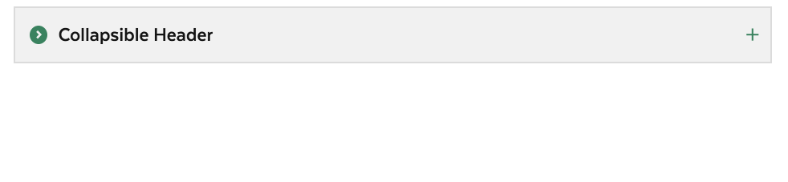
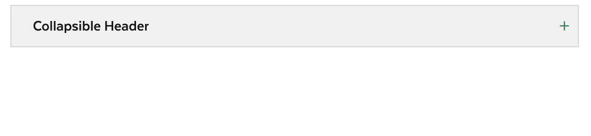
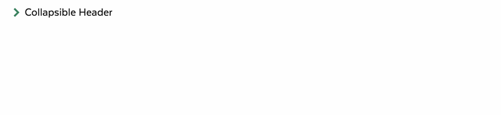

# Accordion Item

## Overview

Accordions aid in providing only needed and key content to users. The are created as clickable headers that can collapse or expand to show additional content. Accordions should be used when users only need to consume or interact with specific pieces of content at a given time or if page space is limited.

### Accordion Item Variations

| Visual | Name | Description |
| :--- | :--- | :--- |
|  | Default | This is the default accordion style, a colored heading with bordered content. |
|  | Borderless | A borderless accordion content style. |
|  | Subtle | An accordion whose header turns transparent  in an open state. |
|  | No Icon | An accordion whose header does not include an icon. |
|  | Secondary | An accordion that is a less prominent element on the page. |

### Accessibility & Best Practices

## Code



```markup
<div class="ma__accordion-item">
  <header class="ma__accordion-header">
    <button class="ma__accordion-header__button ma__accordion-header__button--solid" aria-label="Collapsible Header" aria-expanded="false">
      <div class="ma__accordion-header__icon">
        <svg xmlns="http://www.w3.org/2000/svg" width="35" height="35" viewBox="0 0 35 35">
          <path class="st0" d="M17.5,35C7.8,35,0,27.2,0,17.5C0,7.8,7.8,0,17.5,0C27.2,0,35,7.8,35,17.5C35,27.2,27.2,35,17.5,35z M16,9 l-3,2.9l5.1,5.1L13,22.1l3,2.9l8-8L16,9z"></path>
        </svg>
      </div>
      <h2 class="ma__accordion-header__title">Collapsible Header</h2>
    </button>
  </header>
  <div class="ma__accordion-content__body collapsed" style="height: 0px;">
    <p>Most parks and beaches that charge daily parking fees sell MassParks Passes at their contact stations during their paid parking seasons. Just ask to purchase a MassParks Pass and show your driver’s license or proof of residency. Please note: most parks cannot accept credit cards, so you’ll have to pay with cash or a check</p>
  </div>
</div>
```



[Accordion Item in Storybook](https://mayflower.digital.mass.gov/react/?knob-href=%23&knob-accordion.emphasize=true&knob-info=&knob-selectBox.defaultSelected=Green&knob-selectBox.options=[{"text"%3A"Green"%2C"value"%3A"green"}%2C{"text"%3A"Blue"%2C"value"%3A"blue"}]&knob-accordion.border=true&knob-accordion.info=Collapsible%20Header&knob-children.paragraph.text%20%28example%29=Most%20parks%20and%20beaches%20that%20charge%20daily%20parking%20fees%20sell%20MassParks%20Passes%20at%20their%20contact%20stations%20during%20their%20paid%20parking%20seasons.%20Just%20ask%20to%20purchase%20a%20MassParks%20Pass%20and%20show%20your%20driver’s%20license%20or%20proof%20of%20residency.%20Please%20note%3A%20most%20parks%20cannot%20accept%20credit%20cards%2C%20so%20you’ll%20have%20to%20pay%20with%20cash%20or%20a%20check&knob-selectBox.className=ma__select-box%20js-dropdown&knob-List%20Item%200=This%20is%20a%20list%20item%20in%20an%20unordered%20list&knob-tableOptions.feeTable={"head"%3A{"rows"%3A[{"rowSpanOffset"%3Afalse%2C"cells"%3A[{"heading"%3Afalse%2C"colspan"%3A""%2C"rowspan"%3A""%2C"text"%3A"Type"}%2C{"heading"%3Atrue%2C"colspan"%3A""%2C"rowspan"%3A""%2C"text"%3A"Name"}%2C{"heading"%3Atrue%2C"colspan"%3A""%2C"rowspan"%3A""%2C"text"%3A"Fee"}]}]}%2C"bodies"%3A[{"rows"%3A[{"rowSpanOffset"%3Afalse%2C"cells"%3A[{"heading"%3Atrue%2C"colspan"%3A""%2C"rowspan"%3A"4"%2C"text"%3A"Freshwater%20Fishing"}%2C{"heading"%3Afalse%2C"colspan"%3A""%2C"rowspan"%3A""%2C"text"%3A"Resident%20Citizen%20or%20Non-Resident%20Fishing"}%2C{"heading"%3Afalse%2C"colspan"%3A""%2C"rowspan"%3A""%2C"text"%3A"%2427.50"}]}%2C{"rowSpanOffset"%3Atrue%2C"cells"%3A[{"heading"%3Afalse%2C"colspan"%3A""%2C"rowspan"%3A""%2C"text"%3A"Resident%20Citizen%20or%20Non-Resident%20Minor%20Fishing%20%28Age%2015-17%29"}%2C{"heading"%3Afalse%2C"colspan"%3A""%2C"rowspan"%3A""%2C"text"%3A"FREE"}]}%2C{"rowSpanOffset"%3Atrue%2C"cells"%3A[{"heading"%3Afalse%2C"colspan"%3A""%2C"rowspan"%3A""%2C"text"%3A"Resident%20Citizen%20Fishing%20%28Age%2065-69%29"}%2C{"heading"%3Afalse%2C"colspan"%3A""%2C"rowspan"%3A""%2C"text"%3A"%2416.25"}]}%2C{"rowSpanOffset"%3Atrue%2C"cells"%3A[{"heading"%3Afalse%2C"colspan"%3A""%2C"rowspan"%3A""%2C"text"%3A"Resident%20Citizen%20Fishing%20%28Aged%2070%20or%20Over%29"}%2C{"heading"%3Afalse%2C"colspan"%3A""%2C"rowspan"%3A""%2C"text"%3A"FREE"}]}]}%2C{"rows"%3A[{"rowSpanOffset"%3Afalse%2C"cells"%3A[{"heading"%3Atrue%2C"colspan"%3A""%2C"rowspan"%3A"4"%2C"text"%3A"Hunting"}%2C{"heading"%3Afalse%2C"colspan"%3A""%2C"rowspan"%3A""%2C"text"%3A"Resident%20Citizen%20Hunting"}%2C{"heading"%3Afalse%2C"colspan"%3A""%2C"rowspan"%3A""%2C"text"%3A"%2427.50"}]}%2C{"rowSpanOffset"%3Atrue%2C"cells"%3A[{"heading"%3Afalse%2C"colspan"%3A""%2C"rowspan"%3A""%2C"text"%3A"Resident%20Citizen%20Hunting%2C%20%28Age%2065-69%29"}%2C{"heading"%3Afalse%2C"colspan"%3A""%2C"rowspan"%3A""%2C"text"%3A"%2416.25"}]}%2C{"rowSpanOffset"%3Atrue%2C"cells"%3A[{"heading"%3Afalse%2C"colspan"%3A""%2C"rowspan"%3A""%2C"text"%3A"Resident%20and%20Non-Resident%20Citizen%20Hunting"}%2C{"heading"%3Afalse%2C"colspan"%3A""%2C"rowspan"%3A""%2C"text"%3A"FREE"}]}%2C{"rowSpanOffset"%3Atrue%2C"cells"%3A[{"heading"%3Afalse%2C"colspan"%3A""%2C"rowspan"%3A""%2C"text"%3A"Resident%20Hunting"}%2C{"heading"%3Afalse%2C"colspan"%3A""%2C"rowspan"%3A""%2C"text"%3A"%2427.50"}]}]}]}&knob-List%20Item%201=An%20unordered%20list%20is%20a%20list%20in%20which%20the%20sequence%20of%20items%20is%20not%20important.%20Sometimes%2C%20an%20unordered%20list%20is%20a%20bulleted%20list.%20And%20this%20is%20a%20long%20list%20item%20in%20an%20unordered%20list%20that%20can%20wrap%20onto%20a%20new%20line.&knob-List%20Item%202=Lists%20can%20be%20nested%20inside%20of%20each%20other&knob-selectBox.id=color-select&knob-List%20Item%203=This%20is%20the%20last%20list%20item&knob-selectBox.required=true&knob-accordion.icon=circlechevron&knob-Sub%20Item%200=This%20is%20a%20nested%20list%20item&knob-accordion.headerLevel=2&knob-Sub%20Item%201=This%20is%20another%20nested%20list%20item%20in%20an%20unordered%20list&knob-accordion.title=Collapsible%20Header&knob-linkText=Lorem%20ipsum%20dolor%20sit%20amet&knob-selectBox.label=Color%20Scheme%3A&selectedKind=molecules&selectedStory=AccordionItem&full=0&addons=1&stories=1&panelRight=0&addonPanel=storybooks%2Fstorybook-addon-knobs)



Currently Not Available



## Style

### Classnames

| Name | Class Modifier |
| :--- | :--- |
| Default Accordion Item | `.ma__accordion-item` |
| Borderless Accordion Item | `.ma__accordion-item--borderless` |
| Subtle Accordion Item\(modifier on accordion header element\) | `.ma__accordion-header__button--trans` |
| Secondary Accordion Item | `.ma__accordion-item--secondary` |

