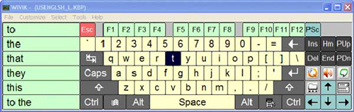
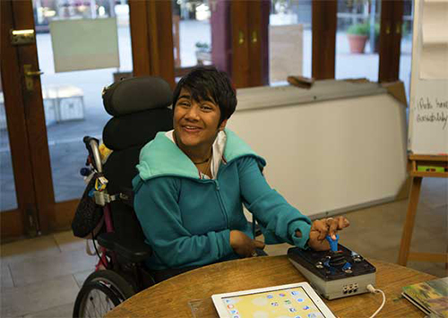

# How people with disabilities use websites

Before we work on web accessibility, it is important to know how people with disabilities use websites. So, we have a better understanding of what kind of assistance they need and why, and furthermore what could improve their experience.  Then, we better understand how we can code to meet their needs.

What we do, how we code, as developers has an impact to our site users.  For web accessibility, we’re not coding to just meet the legal requirement. We code to make our website usable to users in various conditions. 

Here is some information about how people with certain challenges use a website and a computer. 

## Problems with vision  
### Blindness

The definition of blindness here is the level of vision is *not useful enough* for using the web.  Based on this definition, a computer **monitor** and **mouse** would be much less useful to a person who is blind. Even though they are capable to use a mouse, they don't know where to move it or when to click it, since they can't see what's on the screen.

People with substantial, uncorrectable loss of vision in both eyes generally use such as VoiceOver for Mac OS, JAWS for Windows, and so on.  **They use a keyboard to navigate a website.**

**Screen readers read aloud a web page based on how the page is structured as markup, which might not reflect how the page is visually laid out.**  

This means that screen readers are capable to understand how the page is structured.  This feature helps screen reader users tremendously.  It allows them to understand the relationship between page elements. Starting from a header, a main content, a supplemental content, then a footer.  In the content area, how paragraphs are grouped by headings, then how those groups are structured/nested, some bulleted items as a set of a list, and so on.

On the other hand, if the page is not semantically marked up, users would not receive such contextual information which help them understand the page content.

Screen readers can deliver alternative text presentation of non text content such as an image, audio and video. But, if the association of such alternative text and its corresponding non text content is not clear, screen reader users might not be able to receive the content with the context.

Screen reader users cannot skim through a page like sighted users usually do.  It is not easy for them to move around the page back and forth searching for what they are looking for.  Markup with a logical content order is helpful for them to browse .

#### Code for screen reader users

- Semantically structured markup

- Content presentation in a logical order as markup

- Alternative text presentation for non text elements which convey content

- Supplemental context to fill the gap of the visual context sighted users get (ex. Information through a layout)

- Keyboard access

### Low vision

The visual acuity of people with low vision varies widely, but, in general, low vision is defined as a condition in which a *person's vision cannot be fully corrected by glasses*. 

The most common technology used by people with low vision is screen magnifiers, assistive technology to adjust the page elements' contrast to suit their vision condition. Some people with low vision will change the settings in their operating system and/or browser to not only enlarge the text, but to increase the contrast of the text in relation to the background.

Image source: [https://www.enhancedvision.com](https://www.enhancedvision.com)

The image is enlarging a page in the book, but you get an idea how big low vision users could enlarge an object to be able to recognize.

#### Code for low vision users

- To help low vision users to recognize objects with their preferred adjustment, the styles on the page should be able to be overridden by users for font size, font colors, background colors to adjust contrast.

- Relative units is used for font size, letter spacing, line spacing and such to maintain the proportion  of elements as the page gets zoomed in or out 

- No overwrap of elements occurs as the page gets zoomed in
Scroll bars are displayed as the content overflows from the browser window, or another method to access the overflowing content to be accessed.

- No text as images(pixelation as enlarging an image makes hard to recognize the object),
Page elements have sufficient contrast against their background.

### Color-blindness

People with color blindness cannot perceive (see) the difference between certain color combinations.

They might use assistive technology to transform colors by converting to ones they can recognize. But, you'd better prepare your website assuming they don't use assistive technology.

Image source: [http://www.iphonehacks.com](http://www.iphonehacks.com)

## Problems with vision and hearing  

### Deaf blindness

Deaf-blind people rely on their sense of touch to use websites.

Screen readers can also be used by those who are both deaf and blind. Rather than convert text into speech, screen readers for the deaf-blind convert text into Braille characters on refreshable Braille devices, which have small pins that can be raised or lowered to form Braille characters which the deaf-blind individual can feel.

Image source: [https://www.everydaysight.com](https://www.everydaysight.com)

#### Code for deaf blindness

- Semantically structured markup

- Content presentation in a logical order as markup 

- Alternative text presentation for non text elements which convey content

- Supplemental context to fill the gap of the visual context sighted users get (ex. Information through a layout)

- Keyboard access

## Problems using a mouse or keyboard  

The conditions for physical disabilities to use websites are generally related to ability to use a mouse and/or keyboard.

### Inability to use a mouse or/and a keyboard

To use the Web, people with physical disabilities often use specialized hardware and software such as:

- Ergonomic or specially designed keyboard or mouse;

Image source: [https://www.naturalpoint.com](https://www.naturalpoint.com)

- Head pointer, mouth stick, and other aids to help with typing;

Image source: [https://jimthatcher.com](https://jimthatcher.com)

Image source: [https://www.iaccessibility.com](https://www.iaccessibility.com)

- On-screen keyboard with trackball, joysticks, or other pointing devices;

Image source: [http://abilitynet.wikifoundry.com](http://abilitynet.wikifoundry.com)

Image source: [https://academy.autodesk.com](https://academy.autodesk.com)

- Switches operated by foot, shoulder, sip-and-puff, or other movements;

Image source: [www.continuetolearn.uiowa.edu](www.continuetolearn.uiowa.edu)

- Voice recognition, eye tracking, and other approaches for hands-free interaction.

Image source: [http://visagetechnologies.com](http://visagetechnologies.com)

People with physical disabilities may be using a mouse or mouse-like device only, or keyboard or keyboard-like device only to operate the computer. **People with physical disabilities rely on keyboard support to activate functionality provided on web pages.** 

### Slow response time

They may need more time to type, click, or carry out other interaction, and they may type single keystrokes in sequence rather than typing simultaneous keystrokes (“chording”) to activate commands. Such keystrokes include commands for special characters, shortcut keys, and to active menu items.

### Limited for motor control

People with physical disabilities may have trouble clicking small areas and are more likely to make mistakes in typing and clicking.  They would get an operational ability with the devices mentioned above, but they might not have a control their motion steady enough to achieve their tasks.

[Assistive technology demonstration](https://www.youtube.com/watch?v=4_e_0fI7i3A): 
He shows you how he uses an onscreen keyboard, a voice recognition software, and a sip-and-puff switch.  Depending on their conditions, people with physical disabilities use multiple devices.

#### Code for physical disabilities

- Semantically structured markup

- Content presentation in a logical order as markup 

- Keyboard access

## Problems with hearing.  

People with auditory impairments could consume visual content as long as the level of their vision is not useful enough for using the web.  They would have difficulty with audio content and video contains audio.

### Deafness

Most of people with deafness and hard-of-hearing rely on visual presentation of information. 

Any audio content should provide its corresponding text alternative presentation.

### Hard-of-hearing

Depending on their severity of hard-of-hearing, they might be able to obtain audio content with some adjustment.

Do not assume they use hearing aids, and such assistive devices always meet their needs of hearing.

Audio and video players should offer a volume controller to let users adjust the volume.

When the material has background sounds/noises, the main content could be hard to recognized by people with hard of hearing. Users access the material in the environment is not quiet enough to recognize the content.  

Providing transcript is always helpful.  Make sure the access to such transcript is always available with an easy access.

## Problems with reading and understanding.  

The concept of cognitive disabilities is extremely broad, and not always well-defined. In loose terms, **a person with a cognitive disability has greater difficulty with one or more types of mental tasks than the average person**. 

In fact, one may reasonably argue that a great deal of web content cannot be made accessible to individuals with profound cognitive disabilities, no matter how hard the developer tries. Some content will always be too complex for certain audiences. This is unavoidable. Nevertheless, there are still some things that designers can do to increase the accessibility of web content to people with less severe cognitive disabilities.

Usually, the best advice to help users with cognitive disabilities is to provide information in multiple formats, with a heavy emphasis on visual formats. Even though most web content suffers for a lack of visually-enhanced communicative methods, the take-home message is that no one method is sufficient by itself. **Supplement the information with multiple modes and methods of communication.**

#### Code for cognitive disabilities

- Implement the design which is developed for cognitive disabilities

## Takeaway

How we code impacts our site users.  It impacts more keyboard only and assistive technology users.

As developers, we code our website to work with keyboard and assistive technologies. So, those assistive technology users can optimize their offered functionalities. It is our responsibility to make our site users with their challenges can optimize tools available to them on our website. 

We markup with each component’s role and purpose in mind by:

- Keyboard access

- Semantically structured markup

- Content presentation in a logical order as markup

- Alternative text presentation for non text elements which convey content

- Supplemental context to fill the gap of the visual context sighted users get (ex. 
- Information through a layout)

- Styles such as font size, font colors, background colors on the page should be able to be overridden by users to meet their needs

- Relative units is used for font size, letter spacing, line spacing and such to maintain the proportion  of elements as the page gets zoomed in or out 

- No overwrap of elements occurs as the page gets zoomed in

- Scroll bars are displayed as the content overflows from the browser window, or another method to access the overflowing content to be accessed

- No text as images(pixelation as enlarging an image makes hard to recognize the object)

- Page elements have sufficient contrast against their background

Well structured semantic markup is essential to an accessible website.  This sets a base of accessibility.

Providing large clickable areas, enough time to complete tasks, and error correction options for forms are important design aspects. Other important design aspects include providing visible indicators of the current focus, and mechanisms to skip over blocks, such as over page headers or navigation bars. People with cognitive and visual disabilities share many of these requirements.

