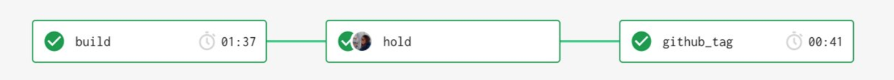

# Mayflower Release

Mayflower Release involves cutting a Github tag following [Semantic Versioning](./versioning.md) leveraging CircleCI with these [scripts](/scripts). The release entails:

- Build and publish the [@massds/mayflower-tokens](https://www.npmjs.com/package/@massds/mayflower-tokens) NPM packages
- Build and publish the [@massds/mayflower](https://www.npmjs.com/package/@massds/mayflower) NPM package
- Build and publish the [@massds/mayflower-react](https://www.npmjs.com/package/@massds/mayflower-react) NPM package
- Build and publish the [@massds/mayflower-react](https://www.npmjs.com/package/@massds/mayflower-react) NPM package
- Build and publish the [massgov/mayflower-artifacts](https://packagist.org/packages/massgov/mayflower-artifacts) PHP package
- Build, test and deploy the [Mayflower homepage site](https://mayflower.digital.mass.gov/)
- Build, test and deploy the [Patternlab site](https://mayflower.digital.mass.gov/patternlab)
- Build, test and deploy the [Storybook site](https://mayflower.digital.mass.gov/react)
- Deploy to documentation to the [Mayflower Gitbook](https://mayflower.digital.mass.gov/docs)


## Auto Release
Mayflower releases are automated using CircleCI and it's scheduled for every **Monday at 2pm (EDT)** (See the cron time in [CircleCI config](/.circleci/config.yml)).

1. At the scheduled cron time, CircleCI will run release_branch and try to create a release branch from develop. (If no new changelogs, the task will fail and stop.)
1. A release branch will be created based on the previous release tag, e.g. 9.38.0, and increment based on the impact levels in each new changelogs. E.g. only "patches"
1. The script [compile-changelogs](/scripts/compile-changelogs.js) gets triggered on the release branch, and all files under the [changelog folder](../../changelogs) gets compiled and added to [CHANGELOG.md](../../CHANGELOG.md).
1. A pull request gets created into master with descriptions
1. **Once all the Circle tests are passed in the PR, review and "Merge" the PR into master.**
1. **Upon approving the release PR, release the "hold" on `github_tag` in CircleCI.**

1. A release will be cut for Mayflower.
1. Merge `master` back into `develop`.

## Creating a Hotfix
To do a hotfix directly into `master`:
1. Create a hotfix branch with the prefix `hotfix/`.
1. After committing your changes, create a Pull Request into the `master` branch.
1. Add a changelog following the [changelog template](/changelogs/template.yml).
1. Run script `node scripts/compile-changelogs` from the repo root.
1. Commit the changes and push up to the remote hotfix branch.
1. **Once all the Circle tests are passed in the PR, review and "Squash and merge" the PR into master.**
1. **Upon approving the release PR, release the "hold" on `github_tag` in CircleCI.**

1. A release will be cut for Mayflower.
1. Merge `master` back into `develop`.

## Creating a Manual Release

In a case that a manual release from `develop` is needed:
1. Run `$ node scripts/release-branch.js` from the repo root on `develop` branch
1. A release branch will be created with changelogs compiled and changes committed.
1. Push up the branch and create a PR into `master`, add the newly compiled changelogs to the description as the PR description.
1. **Once all the Circle tests are passed in the PR, review and "Merge" the PR into master.**
1. **Upon approving the release PR, release the "hold" on `github_tag` in CircleCI.**

1. A release will be cut for Mayflower.
1. Merge `master` back into `develop`.

>If you have a Github API token that has write access to the Mayflower Repo, instead of the steps above you can also automate the pull request creation by running (Linux):
```
DANGER_GITHUB_API_TOKEN=[Your_Github_API_Token] node scripts/release-branch.js
```

---
The release automation requires the changelogs being compliant, refer to [Changelog Instructions](./changelog-instructions.md) for more details.
